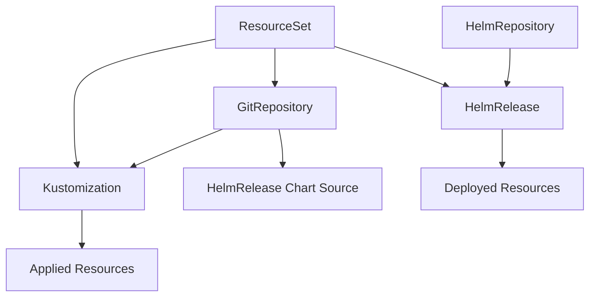

# Resource Management Specification

This document defines how FluxCLI handles FluxCD resource types, their operations, and data representation.

## Supported Resource Types

### 1. GitRepository (source.toolkit.fluxcd.io/v1)

**Purpose**: Defines a Git repository as a source for FluxCD

**Key Fields**:
- `spec.url`: Git repository URL
- `spec.ref.branch`: Target branch
- `spec.ref.tag`: Target tag
- `spec.ref.semver`: Semantic version constraint
- `spec.interval`: Reconciliation interval
- `spec.secretRef`: Authentication secret reference

**Status Indicators**:
- `Ready`: Repository accessible and revision stored
- `conditions[].type`: Ready, Stalled
- `artifact.revision`: Current stored revision
- `artifact.lastUpdateTime`: Last successful fetch

**Operations**:
- Suspend/Resume reconciliation
- Force reconcile (fetch latest)
- View commit history
- Check authentication status

**Display Format**:
```
NAME            READY   STATUS     AGE    URL                           REVISION
flux-system     True    Stored     2d     https://github.com/org/repo   main/a1b2c3d
podinfo         False   Failed     4h     https://github.com/org/app    main/stale
```

### 2. HelmRepository (source.toolkit.fluxcd.io/v1)

**Purpose**: Defines a Helm chart repository as a source

**Key Fields**:
- `spec.url`: Helm repository URL
- `spec.interval`: Check interval for updates
- `spec.secretRef`: Authentication credentials
- `spec.type`: Repository type (default, oci)

**Status Indicators**:
- `Ready`: Repository index downloaded
- `artifact.revision`: Index file revision
- `conditions[].message`: Detailed status information

**Operations**:
- Suspend/Resume index updates
- Force index refresh
- View available charts
- Test repository connectivity

**Display Format**:
```
NAME            READY   STATUS     AGE    URL                           CHARTS
bitnami         True    Indexed    1d     https://charts.bitnami.com    247
podinfo         True    Indexed    2h     https://stefanprodan.github   1
```

### 3. Kustomization (kustomize.toolkit.fluxcd.io/v1)

**Purpose**: Applies Kustomize configurations to the cluster

**Key Fields**:
- `spec.sourceRef`: Reference to source (GitRepository, etc.)
- `spec.path`: Path within the source
- `spec.interval`: Reconciliation interval
- `spec.prune`: Enable pruning of deleted resources
- `spec.targetNamespace`: Target namespace override

**Status Indicators**:
- `Ready`: All resources applied successfully
- `status.inventory`: List of applied resources
- `conditions[].type`: Ready, Progressing, Stalled

**Operations**:
- Suspend/Resume reconciliation
- Force reconcile
- View applied resources (inventory)
- Dry-run validation
- Prune orphaned resources

**Display Format**:
```
NAME            READY   STATUS        AGE    SOURCE           PATH        APPLIED
apps            True    Applied       1d     flux-system      ./apps      12/12
infrastructure  True    Applied       2d     flux-system      ./infra     8/8
tenants         False   Progressing   30m    flux-system      ./tenants   2/5
```

### 4. HelmRelease (helm.toolkit.fluxcd.io/v2)

**Purpose**: Manages Helm chart deployments

**Key Fields**:
- `spec.chart.spec.chart`: Chart name
- `spec.chart.spec.sourceRef`: Reference to HelmRepository
- `spec.chart.spec.version`: Chart version
- `spec.values`: Chart values override
- `spec.interval`: Reconciliation interval

**Status Indicators**:
- `Ready`: Helm release deployed successfully
- `status.lastAppliedRevision`: Current chart revision
- `conditions[].type`: Ready, Released, Remediated

**Operations**:
- Suspend/Resume releases
- Force reconcile/upgrade
- Rollback to previous revision
- View Helm history
- Extract values

**Display Format**:
```
NAME         READY   STATUS     AGE    CHART           VERSION   REVISION
podinfo      True    Released   1d     podinfo         6.3.4     3
nginx        True    Released   2d     nginx-ingress   4.1.0     1
prometheus   False   Failed     30m    prometheus      15.6.0    2
```

### 5. ResourceSet (flux.controlplane.io/v1alpha1)

**Purpose**: Groups multiple Flux resources as a single unit

**Key Fields**:
- `spec.resources`: List of Flux resources to manage
- `spec.suspend`: Suspend all managed resources
- `spec.interval`: Reconciliation interval

**Status Indicators**:
- `Ready`: All resources in set are ready
- `status.conditions`: Aggregate status of all resources
- `status.resources`: Individual resource statuses

**Operations**:
- Suspend/Resume entire set
- View individual resource status
- Force reconcile all resources
- Add/remove resources from set

**Display Format**:
```
NAME            READY   STATUS     AGE    RESOURCES    READY/TOTAL
frontend-app    True    Applied    2d     4            4/4
backend-api     False   Degraded   1d     6            4/6
```

## Resource Operations

### Suspend/Resume Operations

**Suspend Behavior**:
- Sets `spec.suspend: true` on the resource
- Stops reconciliation loop
- Preserves current deployed state
- Maintains resource relationships

**Resume Behavior**:
- Sets `spec.suspend: false` or removes field
- Resumes normal reconciliation
- Triggers immediate reconciliation
- Restores monitoring and updates

**Implementation**:
```yaml
# Suspend operation patch
spec:
  suspend: true

# Resume operation patch  
spec:
  suspend: false
```

### Force Reconciliation

**Mechanism**: Adds/updates reconciliation annotation

**Annotation Format**:
```yaml
metadata:
  annotations:
    reconcile.fluxcd.io/requestedAt: "2025-01-21T10:30:00Z"
```

**Behavior**:
- Triggers immediate reconciliation
- Bypasses interval-based scheduling
- Fetches latest from source
- Applies all changes immediately

### Resource Deletion

**Safety Checks**:
- Confirmation prompt for destructive operations
- Display of dependent resources
- Option to preserve deployed resources

**Cascade Behavior**:
- GitRepository deletion affects dependent Kustomizations
- HelmRepository deletion affects dependent HelmReleases
- Kustomization deletion can prune applied resources

## Status and Health Monitoring

### Health States

| State | Description | Color | Icon |
|-------|-------------|-------|------|
| Ready | Resource functioning correctly | Green | ✓ |
| Progressing | Reconciliation in progress | Yellow | ⟳ |
| Failed | Reconciliation failed | Red | ✗ |
| Suspended | Reconciliation suspended | Gray | ⏸ |
| Unknown | Status not available | Gray | ? |

### Condition Types

**Common Conditions**:
- `Ready`: Overall resource readiness
- `Reconciling`: Reconciliation in progress
- `Stalled`: Reconciliation stuck or failing

**Resource-Specific Conditions**:
- `ArtifactInStorage` (Sources): Artifact stored successfully
- `Applied` (Kustomizations): Resources applied to cluster
- `Released` (HelmReleases): Helm chart deployed
- `Remediated` (HelmReleases): Failed release recovered

### Event Integration

**Event Sources**:
- FluxCD controller events
- Kubernetes resource events
- Helm operation events

**Event Types**:
- `Normal`: Successful operations
- `Warning`: Failures or issues
- `Info`: Informational messages

## Resource Relationships

### Dependency Graph



### Cross-References

**Source References**:
- Kustomizations reference GitRepositories
- HelmReleases reference HelmRepositories
- Charts can reference GitRepositories

**Impact Analysis**:
- Show downstream effects of suspending sources
- Highlight dependencies before deletion
- Trace reconciliation failures to root cause

## Data Caching and Refresh

### Caching Strategy

**Resource Lists**:
- Cache duration: 30 seconds
- Invalidation: On user operations
- Background refresh: Configurable interval

**Resource Details**:
- Cache duration: 10 seconds  
- Immediate update: After operations
- Event-driven updates: Status changes

### Update Mechanisms

**Polling**:
- List resources: Every refresh interval
- Status updates: Every 5 seconds
- Event queries: Every 2 seconds

**Watch Streams**:
- Resource modifications
- Status condition changes
- Related Kubernetes events

## Error Handling

### API Errors

**Connection Failures**:
- Display cached data with staleness indicator
- Show connection status in UI
- Automatic reconnection attempts

**Permission Errors**:
- Clear indication of insufficient permissions
- Suggest required RBAC permissions
- Graceful degradation of functionality

**Resource Not Found**:
- Handle deleted resources gracefully  
- Remove from cache and display
- Update dependent views

### Operation Errors

**Validation Errors**:
- Pre-validate operations where possible
- Display validation errors clearly
- Suggest corrections

**Conflict Errors**:
- Detect resource conflicts
- Offer retry mechanisms
- Display conflict resolution options

## Performance Optimization

### Batch Operations

**List Queries**:
- Fetch multiple resource types in parallel
- Use label selectors for efficiency
- Implement pagination for large sets

**Status Updates**:
- Batch condition queries
- Minimize API calls per refresh
- Cache unchanged resources

### Memory Management

**Resource Limits**:
- Maximum cached resources per type
- Automatic cleanup of stale entries
- Memory usage monitoring

**Efficient Updates**:
- Delta updates for changed resources
- Minimal data structures
- Lazy loading of detailed information

## Integration Points

### kubectl Integration

**Compatibility**:
- Use same kubeconfig files
- Respect current context
- Honor namespace preferences

**Fallback Operations**:
- Complex operations via kubectl
- YAML editing with external editor
- Direct API access when needed

### FluxCD CLI Integration

**Command Parity**:
- Similar operations to `flux` CLI
- Consistent behavior and output
- Complementary functionality

**Data Sharing**:
- Same resource access patterns
- Compatible configuration handling
- Shared understanding of FluxCD concepts